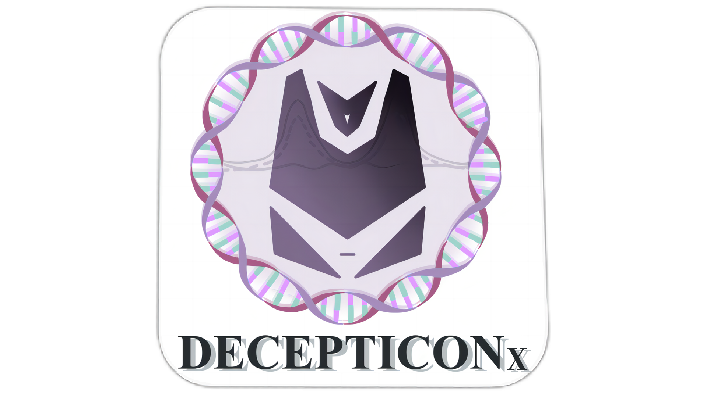

# DECEPTICONx


A Pan-cancer Microenvironment atlas constructed by DECEPTICONx

# Install associated packages
```R
#BayesPrism
library("devtools")
install_github("Danko-Lab/BayesPrism/BayesPrism")

#MuSic
BiocManager::install("TOAST")
BiocManager::install("SingleCellExperiment")
devtools::install_github('xuranw/MuSiC')

#MuSiC2
# install devtools if necessary
if (!"devtools" %in% rownames(installed.packages())) {
  install.packages('devtools')
}
# install the MuSiC2 package
if (!"MuSiC2" %in% rownames(installed.packages())) {
  devtools::install_github('Jiaxin-Fan/MuSiC2')
}
# load
library(MuSiC2)

#monocle3 (Detailed installation tutorials for monocle3 are available at https://cole-trapnell-lab.github.io/monocle3/)
if (!requireNamespace("BiocManager", quietly = TRUE))
install.packages("BiocManager")
BiocManager::install(version = "3.14")
BiocManager::install(c('BiocGenerics', 'DelayedArray', 'DelayedMatrixStats',
                       'limma', 'lme4', 'S4Vectors', 'SingleCellExperiment',
                       'SummarizedExperiment', 'batchelor', 'HDF5Array',
                       'terra', 'ggrastr'))
devtools::install_github('cole-trapnell-lab/monocle3')

#DECEPTICON (DECEPTICON installation package is downloaded from website https://github.com/Hao-Zou-lab/DECEPTICON)
install.packages("DECEPTICON_1.0.0.4.tar.gz", repos = NULL, type = "source")
```

# Install DECEPTICONx
```R
install.packages("DECEPTICONx_1.0.0.tar.gz", repos = NULL, type = "source")
```

# Preparatory Work


# Run DECEPTICONx
```R
library(DECEPTICONx)
```
bulk samples (m * n matrix with m genes and n samples) and single-cell sequencing data (sc.dat, m * n matrix with m genes and n cells) were input to make the expression template required for deconvolution (i * k matrix with i genes and k cell types).

`subtype` is an n*2 matrix, the first column is the cell name of sc.dat (rownames), and the second column is the cell subtype

run_DECEPTICONx <- function (bulk.samples,sc.dat,subtype,RUNpath, light = TRUE, custom.template = TRUE)

`RUNpath` is the path where the above files (“custom.signature”, “DOCKER_codes.R”, etc.) are stored.

`custom.template` set TRUE for custom signature matrix.

`cell_types` can enter in "nk", "b", "cd4", "cd8", "fibroblast", "macrophage", six kinds of cell types.

`signature_matrix` folder contains reference templates for gene expression in the deconvolution of six major cell categories.

Example:
```R
#Run DECEPTICONx with custom expression templates
run_DECEPTICONx(bulk.samples = "./user_path/bulk.txt", sc.dat, subtype,
               RUNpath = "./user_path", custom.template = TRUE)                          
 
#Run DECEPTICONx with fixed expression templates
run_DECEPTICONx(bulk.samples = "./user_path/bulk.txt",cell_types=c("nk","b","cd4","cd8","fibroblast","macrophage")
               RUNpath = "./user_path",custom.template = FALSE)   
```
